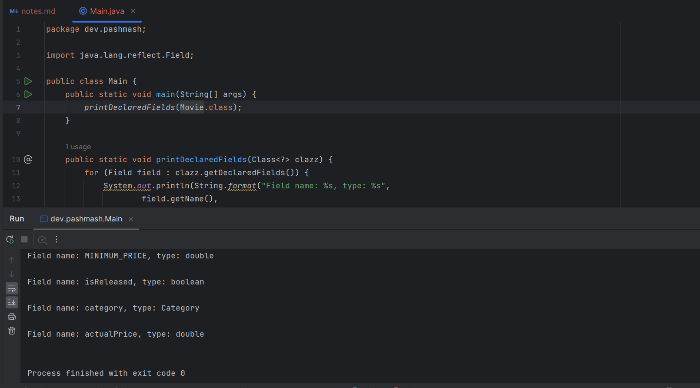
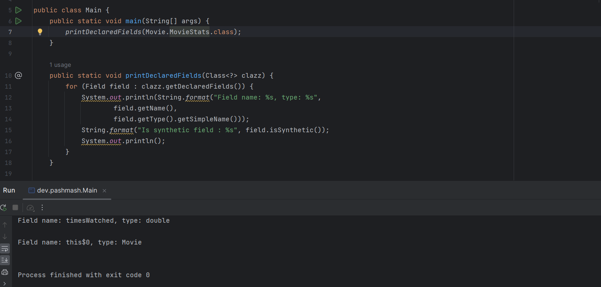
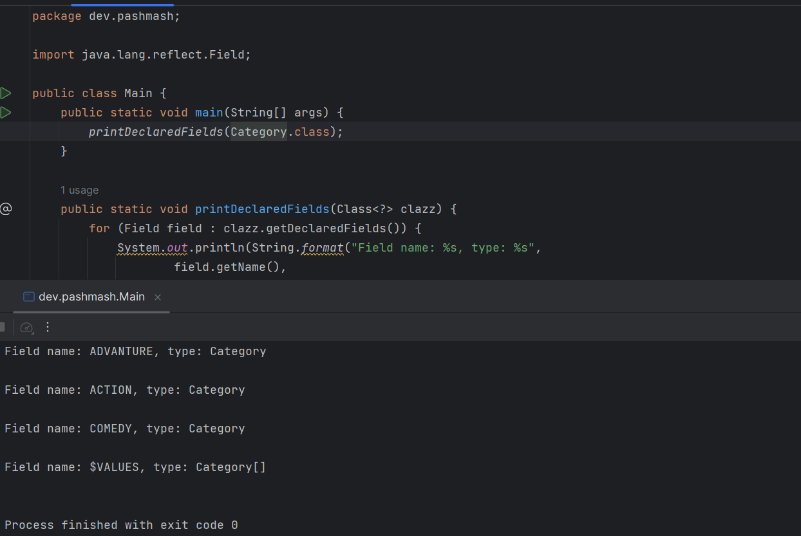
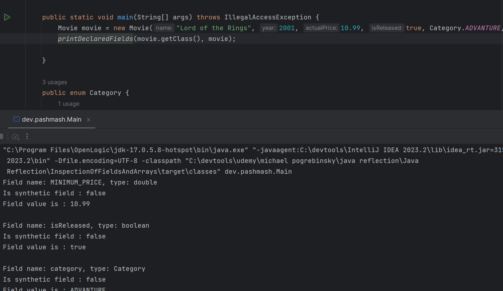

Objective 

Intro to the field class

synthetic class fields

wayst to obtain Field class objects

Getting class Field values

Obtaining Field objects of a class
-------

Class.getDeclaredFields() returns an array of Field objects that reflect all the declared fields of the class or interface represented by this Class object, including public, protected, default (package) access, and private fields, but excluding inherited fields.

Class.getFields() returns an array containing Field objects reflecting all the accessible public fields of the class or interface represented by this Class object.

Class.getField(String name) returns a Field object that reflects the specified public member field of the class or interface represented by this Class object.

if we know the fields name :
- we can use the Class.getField(String name) method to obtain the Field object
- we can use the Class.getDeclaredField(String name) method to obtain the Field object
- if the field is not public, we need to setAccessible(true) on the Field object to be able to access it
- we can use the Field.get(Object obj) method to get the value of the field

Synthetic fields
---

- Synthetic fields are fields that are generated by the compiler for various reasons. For example, if you have a class with a private method, and you call that method from another class, the compiler generates a synthetic field that holds a reference to the enclosing class instance.

- Synthetic fields are not part of the source code, and they are not visible at the source code level. They are generated by the compiler, and they are not accessible via reflection.

Enum
----

Getting class Field values
----

Java Reflections - Fields

- Using the Field class , we can get information about a class's fields, such as their names, types, and modifiers. We can also get and set the values of a class's fields dynamically at runtime.
- we can write generic algorithms and libraries that operate on objects 
    - Whose type is not known until runtime
    - Dont even exist until the program is executed

-----------------

Reading Fields - JSON Serialization

- Java Reflection - Fields use cases 
- Practical example of an Object to Json Serializer