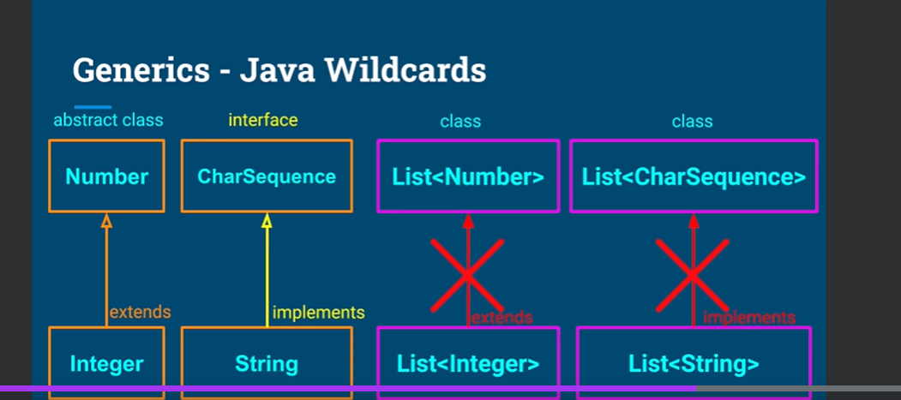
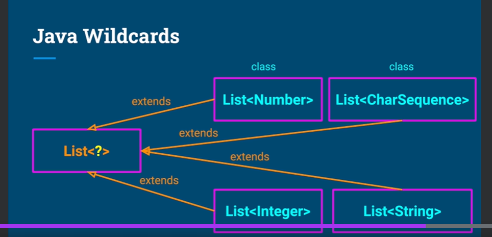
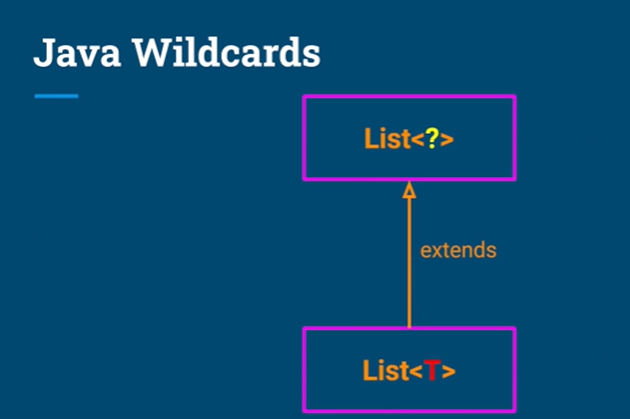

What we learn in this lecture 
-------------------

- ### Intro to reflection
- ### java wildcards
- ### ways to obtain an object of type Class<?>

--------------------------------
## Reflection Entry Points - Class<?>

Class<?> is an entry point  to reflection.
An object of type Class<?> represents a class or interface in a running Java application.
--------------------------------------

## Three ways to obtain an object of type Class<?>:

1. Object.getClass()

``` java
String stringObject = "Some-String";
Car car = new Car();
Map<String , Integer> map = new HashMap<>();
```

``` java 
Class<String> stringClass = stringObject.getClass();
Class<Car> carClass = car.getClass();
Class<?> mapClass = map.getClass(); // Class<?> is a wildcard type of HashMap not Map interface
```

No object.getClass() for primitives types

``` java
boolean b = true;
int value = 100;
double price = 100.0;

Class<?> booleanClass = b.getClass(); // compile error
Class<?> intClass = value.getClass(); // compile error
Class<?> doubleClass = price.getClass(); // compile error
```
2. Class.class

.class suffix to a type name to get a Class<?> object representing the type.
``` java
Class<String> stringClass = String.class;
Class<Car> carClass = Car.class;
Class<?> mapClass = HashMap.class;

.class - Primitive types

Class booleanClass = boolean.class;
Class intClass = int.class;
Class doubleClass = double.class;

class MyClass{
    private int value;
    public boolean isNegative(float x){
        ...
    }
}
```

3.Class.forName()
```java
Class<?> stringClass = Class.forName("java.lang.String");
Class<?> carClass = Class.forName("com.example.Car");
Class<?> mapClass = Class.forName("java.util.HashMap");

Class<?> booleanClass = Class.forName("vehicle.Car$Engine")
package vehicles;
class Car{
    ...
    static class Engine{
        ...
    }
}


No Class.forName() for primitive types 
Class<?> booleanClass = Class.forName("boolean"); // runtime error
Class<?> intClass = Class.forName("int"); // runtime error
Class<?> doubleClass = Class.forName("double"); // runtime error
```

Notes on Class.forName()
- Class.forName() throws a checked exception called ClassNotFoundException.
- Class.forName() is a static method of the class java.lang.Class.
- Class.forName() is overloaded. It has a version that takes a second argument of type boolean. If the second argument is true, the class is initialized. If the second argument is false, the class is not initialized. The default value is true.


- Class.forName() is the least safest way to get a Class<?> object.
- It is the least safe because it throws a checked exception.
- The other two ways do not throw checked exceptions.
- Class.forName() is the most flexible way to get a Class<?> object.
- It is the most flexible because it can be used to get a Class<?> object for a class that is not on the classpath at compile time.
- The other two ways can only be used to get a Class<?> object for a class that is on the classpath at compile time.
- Class.forName() is the slowest way to get a Class<?> object.
- It is the slowest because it has to do a runtime search of the classpath to find the class.
- The other two ways do not have to do a runtime search of the classpath to find the class.
- Class.forName() is the only way to get a Class<?> object for a primitive type.
- The other two ways cannot be used to get a Class<?> object for a primitive type.

**Usecases**
- Class.forName() is used to get a Class<?> object for a JDBC driver.
- Class.forName() is used to get a Class<?> object for a class that is not on the classpath at compile time.
- Class.forName() is used to get a Class<?> object for a primitive type.
--------------------------------------

Generics - Java Wildcards

- Java **generics** are a compile-time feature.
- Java **generics** are implemented using type erasure.
- Java **generics** are not available at runtime.


- Java **wildcards** are a runtime feature.
- Java **wildcards** are implemented using reflection.
- Java **wildcards** are available at runtime.
- Java **wildcards** are used to implement generics at runtime.







## Summary

- Class<?> is an entry point to reflection.
- Learn three ways to obtain an object of type Class<?>.
    - Object.getClass()
    - Class.class
    - Class.forName() 
- Java Wildcards are a runtime feature.

